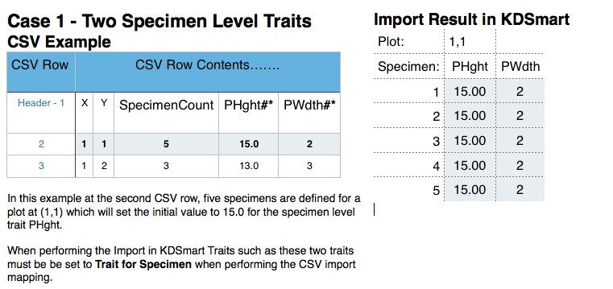
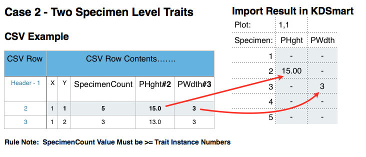
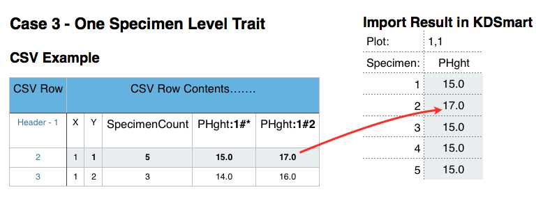
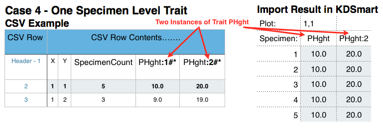
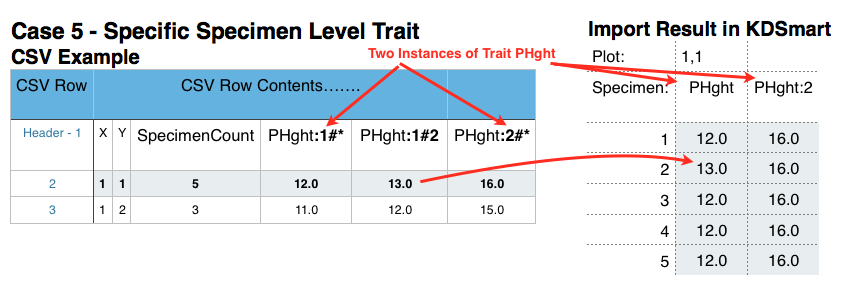
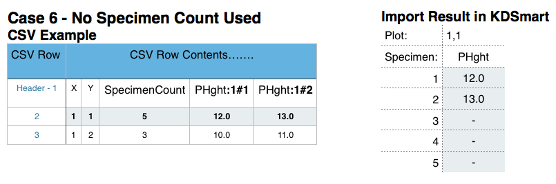
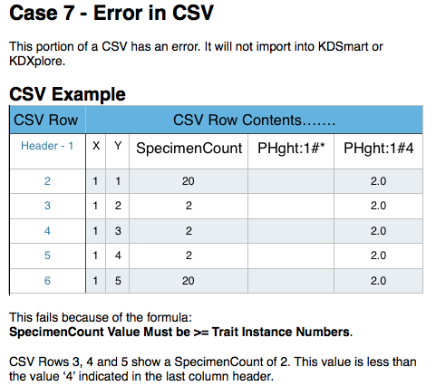

.. File converted, quickly, from Brian's KDSmart User Guide: Appendix B: CSV Import File Formats.docx
.. h1 == 
.. h2 ""
.. h3 **
.. h4 

.. include:: imagerefs.txt

.. Following raw and role statements are required to allow use of coloured text

.. raw:: html

    
    

.. role:: blue

.. role:: peru

=================
CSV File Formats
=================

These pages provide information and formatting assistance for the construction of valid CSV Trial/Nursery files for import into KDSmart and KDXplore.

KDSmart and KDXplore share the same import code base, designed to make the task easier. This introduction will help with understanding what needs to be prepared for a CSV import using either application.

.. note:: Other data import methods exist, instead of CSV files, for loading Trial/Nursery/Trait/Tag data into KDSmart/KDXplore which can offer better and longer term advantages.

|br|

KDSmart/KDXplore Import Mapping
===============================

Importing a Trial using CSV format in KDSmart/KDXplore commences with an attribute mapping table, similar to the examples in the following illustration. This is an important step which helps you setup how your Trial or Nursery information is loaded and defined in each application. 

**Note:** This method of attribute selection is employed to make the import task easier, rather than keep editing and adjusting the CSV file format.

Before the import proceeds, CSV Column Headings in the file need to be assigned an *Attribute Type* using the "Import As" column.

.. tabularcolumns:: |\Y{0.5}|\Y{0.5}|

.. only:: html

    |center-start|
    
    
    .. list-table:: :blue:`Trait Name Style` Import Trial from CSV Column Mapping Example  
       :widths: 30 30
       :class: longtable
       :header-rows: 1
    
       * - **KDSmart**
         - **KDXplore**
       * - .. thumbnail:: images/kds-import-trialmapping.png
                :width: 80%
                :show_caption: True
                :title: KDSmart CSV Column Mapping Example
         - .. thumbnail:: images/kdx-import-trialmapping.png
                :width: 80%
                :show_caption: True
                :title: KDXplore CSV Column Mapping Example
    
    |center-end|

.. only:: latex
    
    .. tabularcolumns:: |\Y{0.5}|\Y{0.5}|
    
    .. list-table:: :blue:`Trait Name Style` Import Trial from CSV Column Mapping Example  
       :widths: 30 30
       :class: longtable
       :header-rows: 1
    
       * - **KDSmart**
         - **KDXplore**
       * - .. figure:: images/kds-import-trialmapping.png
                :scale: 100%
                :alt: KDSmart CSV Column Mapping Example
                
                KDSmart CSV Column Mapping Example
         - 
           .. figure:: images/kdx-import-trialmapping.png
                :scale: 100%
                :alt: KDXplore CSV Column Mapping Example
                
                KDXplore CSV Column Mapping Example
        

The interface examples above illustrate the:

* File chosen to import is "maize-with-data.csv";
* Name of the CSV's column Headings;
* First data row; and 
* Blue (KDSmart) 'Import As' column. 

Selecting the 'Import As' entry, for each row as necessary, reveals a drop down list of attributes that can be assigned to the column. KDSmart/KDXplore makes a 'best guess' of the attribute type where possible based upon the first row of data.

|br|

Trials and Plots
================

The following tables list each Attribute Type. Pay particular attention to the ones marked as :blue:`blue text`:

.. tabularcolumns:: |\Y{0.2}|\Y{0.8}|

.. list-table:: :blue:`Trait Name Style` Attribute Type Usage
   :widths: 15 30
   :class: longtable
   :header-rows: 1

   * - **Attribute Type**
     - **Usage**
   * - - :blue:`Trial Attribute` or 
       - :blue:`Plot Attribute`
     - Indicates KDSmart must retain the value as an attribute, either for the Trial or for each Plot respectively.
   * - - :blue:`Trait` or 
       - :blue:`Trait for Sub-Plot`
     - Applying either of these Attributes to a column causes a *Trait* of that name to be added to the list of Traits for the Trial.
   * - :blue:`Ignore`
     - Use this Attribute to ignore columns in the CSV file.

The *Attribute Types* listed above may be applied to **ANY** heading in the CSV file.

Any columns with a name starting with "Link:", "Date:", "Date\_", "Sub-Plot#:", or "Sub-Plot#_" will be automatically assigned as *Ignore* (but you can always change that if you wish).

.. 
   Editors note - in the above line the reference to column name "Date_" requires the backslash '\' character 
   to prevent, or 'escape', Sphinx translation. As the backslash is not part of the syntax being described
   it is important that it does not appear in the output which would mislead the user.
   
|br|

Trial & Plot Import Options
===========================

When importing a heading classified as :blue:`Trait` or :blue:`Trait for Sub-Plot` KDSmart/KDXplore uses hints in the heading to determine whether it is only a Trait Name or if the heading also identifies a Trait Instance.

.. _Trait Name Style:

This is designated as the :blue:`Trait Name Style`.

You may choose one of the following options:

.. tabularcolumns:: |\Y{0.2}|\Y{0.1}|\Y{0.16}|\Y{0.54}|

.. list-table:: :blue:`Trait Name Style` options:
   :widths: 20 5 20 30
   :class: longtable
   :header-rows: 1

   * - **Option**
     - **Base Instance Number**
     - **Format**
     - **Example / Description**
   * - **No Trait Instance detection**
     - 
     - 
     - All Trait headings will have a single Trait Instance created. Headings of: |br| :peru:`AMT1`, |br| :peru:`AMT:1`, |br| :peru:`AMT__1` |br| will correspond to three different Traits with exactly the names provided.
   * - **Ends in colon followed by digits**
     - 1
     - <traitName> : <instanceNumber>
     - :peru:`AMT`, :peru:`AMT:2` results in Trait Instance numbers of :peru:`1` and :peru:`2`.
   * - **Ends in two underscores then digits**
     - 1
     - <traitName> __ 
       <instanceNumber>
     - :peru:`AMT`, :peru:`AMT\_\_2` results in Trait Instance numbers of 1 and 2.
       Note: Don't include spaces - only depicted here for display purposes.

The other options you need to select are how KDSmart/KDXplore determines Sub-Plots from the CSV headings. This is described in the `Sub-Plot Count and Trait Instances`_ section below.

To specify that a column is for a particular Sub-Plot, add the following suffix :peru:`#nn` (i.e. :peru:`#` followed by digits, which must be an integer greater than zero) where the number identifies the individual.

You may specify whether or not "sub-plot" data is to be collected here or while scoring by touching the Plot icon: |plot-icon| 

The following three tables list, in turn, the headings that are used for different parts of a Trial Import. |br|
Abbreviations used: |br|
:blue:`ID` - Required for Identification  |br|
:blue:`OPT` - Optional |br|
:blue:`ATTR` - Attribute.

|br|

Trial Specific Data
===================

The first table lists the headings that pertain to Trial-specific data. |br|

.. tabularcolumns:: |\Y{0.15}|\Y{0.3}|\Y{0.5}|

.. list-table:: Headings For **Trial** Specific Data
   :widths: 5 20 30
   :class: longtable
   :header-rows: 1

   * - **Attribute Type**
     - **Headings Automatically Recognised**
     - **Description**
   * - :peru:`Trial Planting Date` |br| OPT
     - - PlantingDate 
       - TrialPlantingDate 
       - DatePlanted 
       - Planted 
       - DateSown 
       - Sown 
       - SownDate
     - The base value used for computing ELAPSED_DAYS values for Traits, e.g. Days to Flowering.  (Can be changed manually after import) 
   * - :peru:`Trial Name` |br| OPT
     - Trial Name
     - If present, this is used as the name of the Trialin. If not present, the name of the CSV file will be used.
   * - :peru:`Trial Alias` |br| OPT
     - - Abbreviation 
       - TrialAbbreviation 
       - TrialAcronym 
       - Acronym
     - A short name for the Trial that will be used on screens where there is limited space.
   * - :peru:`Trial Column Name` |br| OPT
     - - ColumnName 
       - NameForColumn
     - This is the word used for the X coordinate (see the attribute type X-Column in the Plot headings table below). |br| Example: for "Range/Row" the value here would be "Range".
   * - :peru:`Trial Row Name` |br| OPT
     - - RowName 
       - NameForRow
     - This is the word used for the Y coordinate (see the attribute type Y-Row in the Plot headings table). |br| Example: for "Range/Row" the value here would be "Range".
   * - :peru:`Trial Plot Name` |br| OPT
     - - CellName 
       - NameForCell 
       - PlotName 
       - NameForPlot
     - This is the word used to describe each "cell". For many plant-related field trials this is likely to be "Plot". For other trials/experiments it may be "Panel", "Pond", "Test-tube" etc.
   * - :peru:`Trial Bundle` |br| OPT
     - - TrialBundle 
       - TrialGroup
       - TB
       - TG
     - Assigns the name of a Trial Bundle for the Trial
   * - :peru:`Trial Database Id` |br| OPT
     - - DatabaseTrialId 
       - TrialId 
       - TrialNumber
     - May be provided to cross-reference to the originating database.
   * - :peru:`Trial Attribute` |br| ATTR
     - :peru:`May apply to any heading in the file.` |br| See `Trial Attribute Headings`_ below.
     - :peru:`Retain the value as an attribute of the Trial. If you apply this type to a column then every row must have the same value.`

|br|

Plot Specific Data
==================

.. tabularcolumns:: |\Y{0.15}|\Y{0.3}|\Y{0.5}|

.. list-table:: Headings For **Plot** Specific Data
   :widths: 5 20 30
   :class: longtable
   :header-rows: 1

   * - **Attribute Type**
     - **Headings Automatically Recognised**
     - **Description**

   * - :peru:`Plot Id` |br| ID |br| Integer
     - - CellId 
       - PlotId 
       - EntryId  
       - Plot
     - If present, uniquely identifies the Plot in the Trial. Must be unique.
   * - :peru:`PlotBlock` |br| ID |br| Integer
     - - PlotBlock 
       - BlockNo  
     - If present uniquely identifies the Block in the Trial.
   * - :peru:`Plot Column (X)` |br| ID |br| Integer
     - - PlotColumn 
       - X 
       - Column 
       - Col 
       - ColumnX 
       - X-Column 
       - Column_No
       - BlockX
     - The X–coordinate of the Plot within the Trial. 
       
       If present, the (X,Y) pair must uniquely identify the Plot in the Trial, OR 
       
       If PlotBlock is selected the (X,Y) pair must be unique within the Block.
   * - :peru:`Plot Row (Y)` |br| ID |br| Integer
     - - PlotRow 
       - Y 
       - Row 
       - RowY 
       - Y-Row 
       - Range_No 
       - Range
       - BlockY
       
     - The Y–coordinate of the Plot within the Trial. 
       
       If present, the (X,Y) pair must uniquely identify the Plot in the Trial, OR
       
       If PlotBlock is selected the (X,Y) pair must be unique within the Block.
   * - :peru:`Plot Note` |br| OPT
     - - PlotNote 
       - Note 
       - TrialUnitComment
     - A description or information for the imported plot.
   * - :peru:`Plot Type` |br| OPT
     - PlotType
     - If present, this specifies the type of plot (e.g. Control, Check, etc.).
   * - :peru:`Plot Barcode` |br| OPT
     - - PlotBarcode 
       - Barcode 
       - TrialUnitBarcode
     - If Plot Barcode column provided it must not be blank. |br| 
       See the User Guide section on Barcode Scanning for further details of how the data in this column is used.
   * - :peru:`Plot Tags` |br| OPT
     - - Tags, 
       - PlotComments, 
       - Comments
     - Additional comments for the imported plot. A list of pipe-separated ( | ) Tag labels.
   * - :peru:`Plot Database Id` |br| OPT
     - - DatabasePlotId, 
       - TrialUnitId, 
       - TrialUnitNumber
     - May be provided to cross-reference to the originating database.
   * - :peru:`Sub-Plot Count` |br| OPT |br| Integer
     - - SpecimenCount, 
       - IndividualCount,
       - Plant Count
     - Number of Sub-Plots or plants present within the plot to be imported. |br| Please read the section below `Sub-Plot Count and Trait Instances`_.
   * - :blue:`Plot Attribute` |br| ATTR
     - :blue:`May be applied to any heading in CSV.` |br| See `Plot Attribute Headings`_ below.
     - :blue:`Retain the value as an attribute of the Plot.` |br| :blue:`Each row may have a different value (including blanks). Choose any subset to display as Plot Info while scoring.`

|br|

Sub-Plot Specific Data
======================

.. tabularcolumns:: |\Y{0.2}|\Y{0.4}|\Y{0.4}|

.. list-table:: Headings For **Sub-Plot** Specific Data
   :widths: 5 20 30
   :class: longtable
   :header-rows: 1

   * - **Attribute Type**
     - **Headings Automatically Recognised**
     - **Description**

   * - :peru:`Sub-Plot Id` |br| ID |br| Integer
     - - SpecimenDatabaseId 
       - Sub-PlotDatabaseId 
       - Sub-PlotDbId  
       - PlantDatabaseId
       - IndividualDatabaseId
     - If present, uniquely identifies the Sub-Plot in the Trial. Must be unique.
   * - :peru:`Sub-Plot Tags` |br| OPT
     - - Sub-PlotTags 
       - SPTags
       - PlantTags
       - IndividualTags
       - SpecimenTags
     - Additional comments for the imported Sub-Plot. A list of pipe-separated ( | ) Tag labels.
   * - :peru:`Sub-Plot Traits` |br| OPT
     - 
     - Any heading with # that is not matched to one of the above Sub-Plot specific headings will default to a Sub-Plot Trait. |br| E.g Plant_Height#6 will default to Sub-Plot Trait.

|br|

Attribute Types for Trait Variations
====================================

This table continues from the two above but lists the Attribute Types for Trait variations and for *excluding* a column from import.

.. tabularcolumns:: |\Y{0.1}|\Y{0.1}|\Y{0.3}|\Y{0.5}|

.. list-table:: Attribute Types For Trait Variations
   :widths: 5 3 20 30
   :class: longtable
   :header-rows: 1

   * - **Attribute Type**
     - **Section**
     - **Headings Automatically Recognised**
     - **Description**
   * - :blue:`Trait` |br| OPT
     - :blue:`Trait`
     - :blue:`May be applied to any heading in the CSV file.`
     - Marks this column as representing a Trait that is scored **only for Plots**.
       
       The *Trait Name Style* governs if a *Trait Instance* is being referenced or not.
   * - :blue:`Trait for Sub-Plot` |br| OPT
     - :blue:`Trait`
     - :blue:`May be applied to any heading in the CSV file.`
     - Marks this column as representing a Trait that is scored **only for Sub-Plots**.
       
       The *Trait Name Style* governs if a *Trait Instance* is being referenced or not.
   * - :blue:`Ignore`
     - 
     - :blue:`May be applied to any heading in the CSV file.`
     - Indicates that this column should **not** be imported.

For an example see the following `A Simple Example`_ topic. 

.. raw:: latex
  
      \newpage

Sub-Plot Count and Trait Instances
==================================

Multiple instances for a Trait can be imported by including the instance number in the heading. For example, importing the second instance of the Trait 'Plant_Height' can be achieved by including a colon :blue:`Plant_Height:2`.

Alternatively using the :blue:`Sub-Plot Count` column instructs KDSmart/KDXplore to create the specified number of Sub-Plots in each plot.

When Sub-Plot Count is present and non-blank, the integer value in this column will cause creation of the given number of Sub-Plots in the Plot.

This will apply to all of the columns that have an *Attribute Type* of :blue:`Trait` or :blue:`Trait for Sub-Plot`.

If a column is **NOT** marked as :blue:`Sub-Plot Count`, no Sub-Plots will be created during the import of the data file; in this case, if you wish to add a Sub-Plot to a plot, use the popup menu that appears when you touch the Plot icon: |plot-icon| (during the scoring activity) and choose the Add Sub-Plot option. This presents a list of all the Traits that are defined as :blue:`Trait for Sub-Plot` and one of these may be selected to score for the new *Sub-Plot*.

|br|

Notes For Importing Subplot Data
"""""""""""""""""""""""""""""""""

The TRAIT FOR SUB-PLOT column heading requires a suffix of :blue:`#` with the Sub-Plot number the value is referring to. 

For example, importing a Plant_Height value for Sub-Plot three have a heading :blue:`Plant_Height#3`. To import for all of the Sub-Plots available (Number seen in Sub-Plot count column) use :blue:`#*`. |br|
If the trait is a specific instance, the instance number can be imported as you would typically just with the Sub-Plot number appended e.g. :blue:`Plant_Height:2#3`.

|br|

Conditions For Importing Subplot Data
""""""""""""""""""""""""""""""""""""""

The Sub-Plot Count column import will create the provided number of empty Sub-Plots for the specified plots.

- Trait for Sub-Plot will create the required number of Sub-Plots for the value ('#Number').
- Trait Sub-Plot numbers ('#Number') cannot be higher than the Sub-Plot Count if both are being imported.
- Sub-Plot Count column is required if :blue:`#*` (for all Sub-Plots) is used.
- There cannot be two identical column names with Trait for Sub-Plot (e.g. Plant_Heigh#1, Plant_Height#1).
- If  :blue:`#*` is used for the same Trait as :blue:`#Number` (e.g. Plant_Height#*, Plant_Height#1) the numbered column (Plant_Height#1) takes priority for the specified Sub-Plot.

|br|

Plot Attribute Headings
=======================

The items below identify headings that are automatically classified as *Plot Attributes* by KDSmart.

- Treatment 
- SelectionHistory, Selection\_History
- ReplicateNumber, Replicate, Rep, Repeticion, REP\_NO
- GenotypeName, Genotype, GID
- Origin, 0rigin :blue:`(that’s a "zero")`
- Designation
- Type
- CID, SID, CROSS, SOURCE, ENTRY\_NO, SUB\_BLOCK, PLOT\_NO
- PedigreeName, Pedigree, BreedersPedigree
- Type

.. Note:: This list will be replaced by the *CSV Import Profile* functionality at a later release. Also the spelling of 'Repeticion' is required as it is within the 'code'.

|br|

Trial Attribute Headings
========================

The following are automatically classified as Plot Attributes by KDSmart:

- SiteName, Site, Location
- SiteYear, Year
- TrialType, TrialTypeName
- TrialStartDate, StartDate

|br|

Values in CSV files
====================

CSV files may contain data in the various data "columns".

For columns marked to be imported as *Traits*, the following rules apply:

1. Blank values will be treated as un-scored Traits as will the word :peru:`UNSCORED` (the latter is not required unless you want to make un-scored trait values very obvious in a CSV file).
2. The word :peru:`MISSING` will be imported as a special token denoting a missing value.
3. The word :peru:`NA` will be imported as a special token denoting "not-applicable" or "not-available" (whatever you take it to mean).

.. note:: All other values will be checked using the **validation rule for the trait**. Any failure to pass the validation check will cause the entire import to fail.

If you select a column to be used as the *Trial Name*, the value in the first data line may not be the same as any existing *Trial* in the database.

Similarly, if you have not chosen a column as the *Trial Name*, the name of the file (excluding anything from the last "." onwards) will be used to check for a pre-existing trial in the database.

.. note:: *Trial Name* checks are **not** case sensitive.

.. raw:: latex
  
      \newpage

A Simple Example
=================

Example File Construction
""""""""""""""""""""""""""

For this simple example (line no.s shown for clarity) the CSV file with three lines consists of: 

.. code-block:: xml
   :linenos:

   date sown,Row,Range,MZC,MZP,#Sub-Plots,LLEN
   2014-12-15,23,4,,,2,
   2014-12-15,21,5,,,0,

.. 
   Editors note: It's not really XML, in the code-block above, however it renders better     than other choices or just using '::'.

Using the "After Sub-Plot Count", described in `Sub-Plot Count and Trait Instances`_, the following definition could be used in KDSmart: |br|

**Note:** In the following table, the top heading row is *NOT* part of the data file.

.. tabularcolumns:: |\Y{0.15}|\Y{0.15}|\Y{0.1}|\Y{0.1}|\Y{0.1}|\Y{0.1}|\Y{0.1}|\Y{0.1}|

.. list-table:: Simple Example: Three Row CSV File (Header Row and Two Data Rows)
   :widths: 15 10 5 5 5 5 10 10
   :header-rows: 1
   :stub-columns: 1

   * - **Attribute Type**
     - **Plating Date**
     - **X-Column**
     - **Y-Row**
     - **Trait**
     - **Trait**
     - Sub-Plot Count
     - Trait for Sub-Plot
   * - CSV Line 1
     - date sown
     - Row
     - Range
     - MZC
     - MZP
     - #Sub-Plots
     - LLEN
   * - CSV Line 2
     - 2014-12-15
     - 23
     - 4
     - 
     - 
     - 2
     - 
   * - CSV Line 3
     - 2014-12-15
     - 21
     - 5
     - 
     - 
     - 0
     - 

|br|

Example Result
"""""""""""""""

The result of importing this diminutive Trial will be:

* Only two plots at positions (23,4) and (21,5);
* Two Traits, MZC and MZP, are being scored for each Plot;
* The first Plot (CSV Line 2) has two Sub-Plots for which the trait LLEN (leaf length) will be scored;
* The second Plot (CSV Line 3) has no Sub-Plots requiring scoring. |br| However, if while Scoring a Sub-Plot was added to the latter Plot, you will then be asked to score the LLEN Trait for the new Sub-Plot.

Additionally, as no columns in this example were designated as X-Column-Name or Y-Row-Name, the default names of "Column" and "Row" is used to describe the Plot coordinates. Following import, the Trial Details can be edited in KDSmart and the row/column names changed to your choice e.g. "Row" and "Range" respectively, if required to make the nomenclature align more closely to your usual vocabulary. Best practice however, is to name them in the CSV file rather than change them in KDSmart.

|br|

Spaces, Case Sensitivity and Blank Lines
========================================

When reading and parsing the headers, KDSmart removes all spaces and performs a case-insensitive comparison to match CSV headings with the automatically recognised built-in headings.

It also skips over any blank lines and takes the first non-blank line as the headings line.

.. raw:: latex
  
      \newpage

Traits
=======

The following table describes the required and optional Trait headings for a CSV file that contains details of Traits that will be used by *Trials*.

.. tabularcolumns:: |\Y{0.2}|\Y{0.15}|\Y{0.6}|

.. list-table:: Required and Optional Trait CSV File Headings
   :widths: 20 20 40
   :class: longtable
   :header-rows: 1

   * - **Heading**
     - **Alternatives**
     - **Notes**
   * - **TraitName**
     - Name
     - This column heading must be present. All others are optional. |br| 
       The value should be kept short and, if you wish to use the name in KDXplore with CALC *Traits* no spaces are permitted and the name **must** begin with a letter.  |br| We recommend using the underscore ( _ ) character or CamelCase to improve readability. |br| See also the description of the import option regarding `Trait Name Style`_.
   * - **TraitAlias** OPT
     - Alias
     - If provided, should be a shorter form of the *TraitName* to use during scoring.
   * - **TraitLevel** OPT 
     - Level 
     - Default: Plot. Versions before (KDSmart V3.0.3, KDXplore Beta1.1.4 or Prod 2.1.4) TraitLevel could specify only *Plot* or *Sub-Plot*.  For versions equal to or above, TraitLevel can specify the trait is either for the: *Plot Level* by using "Plot" or "TrialUnit"; or |br| the *Sub-Plot* level by using "Sub-Plot", "Sub-Plot", "Individual" or "Plant".
   * - **TraitBarcode** OPT
     - Barcode
     - Used to identify the Trait when using a barcode scanner for scoring.
   * - **TraitUnit**
     - Unit, UnitName, TraitUnitName
     - You can provide anything you like that will assist you in remembering what to enter while Scoring.
   * - **TraitDescription**
     - Description, Desc
     - A longer description of the Trait.
   * - **TraitDatatype**
     - Datatype
     - One of CATEGORICAL, DATE, ELAPSED_DAYS, INTEGER, DECIMAL or TEXT. See :ref:`Traits` for further details.
   * - **TraitValidation**
     - TraitValRule, Validation, ValidationRule
     - See :ref:`Traits` for further details.
   * - **DatabaseTraitId**
     - TraitId
     - If you provide this column, KDSmart will record the value and export it on request (a reference to the originating database). See Protected Traits below.

.. Note:: A new Trait can be created directly in KDSmart. If you do this and are also uploading or synchronising your data to KDXplore or KDDart you may have to reconcile the differences if there is already a Trait of the same name (compared in a case-insensitive manner).

.. raw:: latex
  
      \newpage

Overwriting Existing Traits
""""""""""""""""""""""""""""

Entries for existing Traits can be specified in a CSV file. The Traits are matched by Trait Name (ignoring case) and incoming Traits with the same name as one already in the database will be checked for compatibility:

.. tabularcolumns:: |\Y{0.15}|\Y{0.15}|\Y{0.7}|

.. list-table:: Trait Import Overwriting Behaviours
   :widths: 20 20 40
   :class: longtable
   :header-rows: 1

   * - **Trait in Database**
     - **Trait in CSV File**
     - **Action Taken**
   * - Data Type is TEXT
     - Any Data Type
     - The Trait Data Type in the CSV file will replace the data type in the database.
   * - Any other data type
     - Data Type is TEXT
     - A warning is issued identifying the line and the import continues excluding the line from the CSV file.
   * - Any other data type
     - Data Type is not TEXT
     - A warning is issued if the data types are not the same (and the import continues)
   * - Description
     - Description
     - Descriptions are truncated to the current database limit then compared for equality.
         
       If they are the same (ignoring case), a warning will be issued but the new Trait’s description will replace the current one in the database.
       Otherwise:
       
       - CHOICE: must have the choices or the old choices must be a subset of the new choices
       - INTEGER and DECIMAL: the limit "exclusions" must be identical, however the new Trait’s limits may be "wider" than the current Trait in the database
       
       If any of incompatibilities above are identified, a warning is issues and the import continues without altering the current Trait in the database.

.. End of Table

|br|

Protected Traits
""""""""""""""""

If a Trait has been imported with a DatabaseTraitId, it is deemed to be "protected".

In this case you may only edit the Trait Alias and changes to the validation rule are not permitted except for INTEGER and DECIMAL Traits where you may change the range of acceptable values but only to make the range smaller.

For example, if an INTEGER Trait has been defined to have values from 0 to 100 you may only change the lower limit to be 1 or more and the upper limit to be 99 or less.

|br|

Calculated Traits
""""""""""""""""""

These have the Trait Data Type of CALC. No measurements are collected by KDSmart for these Traits.

The value may only be viewed in KDXplore during data curation. KDXplore is able to calculate Trait values from other Traits via entering a formula (similar to Excel).

.. Note:: New Traits cannot be derived from Trait names containing spaces. Recommendation that underscores are used in place of spaces for Trait names, especially if they are intended for use in calculations.

See: :ref:`Calculated_or_Derived_Traits` 

.. raw:: latex
  
      \newpage

Tags
====

The following details the required and optional headings in a CSV file that contains details of Tags that will be used to annotate Plots and Sub-Plots when Scoring a Trial.

.. tabularcolumns:: |\Y{0.2}|\Y{0.2}|\Y{0.2}|\Y{0.4}|

.. list-table:: 
   :widths: 5 10 5 20
   :class: longtable
   :header-rows: 1

   * - **Heading**
     - **Alternatives**
     - **Mandatory**
     - **Description**
   * - **Label**
     - TagLabel, Comment
     - Yes 
     - Name of the Tag e.g. BD for bird damage
   * - **Description**
     - TagDescription, Desc, CommentDescription
     - Yes
     - Tag description
   * - **DatabaseLabelId**
     - LabelId, Id
     - No
     - Useful for cross-reference to the originating database

|br|

Sub-Plot Level Trait Import Examples
====================================

The following six cases illustrate part of the input CSV file and how the Trait will be represented in KDSmart. The last example, case 7, shows what not to do!

|l-case1|

|l-case2|

|l-case3|

|l-case4|

|l-case5|

|l-case6|

|l-case7|

.. raw:: latex
  
      \newpage

Excel Formula for Converting ISO-8601 Timestamp to Excel Date
==============================================================

.. |ISO_link| raw:: html

   <a href="https://en.wikipedia.org/wiki/ISO_8601" target="_blank">ISO-8601 format</a>

When KDXplore or KDSmart use a timestamp for a scored trait value the timestamp is recorded in |ISO_link|. 

Using this format means that you can correctly compare data collected in different
time zones.

Unfortunately Microsoft Excel does not automatically recognise this format. However, using the formula below, you can easily convert the date/time string in ISO-8601 format into an Excel date/time value and render this in a more useful form by using an appropriate cell format (e.g. yyyy-mm-dd hh:mm:ss).

The formula is:

:: 

        =DATEVALUE(LEFT(A1,10))
        + TIMEVALUE(MID(A1,12,8))
        + IF("Z"=MID(A1,20,LEN(A1)-19),0,(INT(MID(A1,20,LEN(A1)-19)/100)*60+MOD(MID(A1,20,LEN(A1)-19),100))/1440)

If you wish to know what the formula is doing, the explanation is below.
The formula above is split across three lines to facilitate the following explanation.

Excel's internal date time format is a *real* number where the part before the decimal point is the *number* of days and the portion after the decimal point is the *fraction* of a day.

The first line of the formula extracts the year/month/day portion and converts it into the full days portion of the result

The second part of the formula extracts the hours/minutes/seconds portion and converts it into the day fraction portion.

The third and final part obtains the time zone portion of the ISO-8601 timestamp and converts it into another day fraction part. It checks for the special *Z time zone* that indicates a zero offset. If it is not *Z*, the time zone is in ±HHMM format so the formula extracts the HH portion separate from the MM portion, computes the total as a number of
minutes and divides by 1440 (the number of minutes in a day) to arrive at a final day fraction component that is added to the amount determined by the first two parts of the formula. Any leading plus or minus sign is used to correctly perform this computation.
