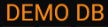

.. rst-class:: chapter-with-expand

.. About Sample Files

.. include:: imagerefs.txt

.. Following raw and role is required to allow the use of brown text

.. raw:: html

    
    
    

.. role:: brown
.. role:: green
.. role:: orange

.. |blue-bars| image:: images/ic_action_drawer_bright_blue.png
            :scale: 20 %

.. |back-btn2| image:: images/android-Back-50.png
            :scale: 40 %

.. |back-btn3| image:: images/kds-android-return-48.png
            :scale: 40 %

.. |back-area| image:: images/kds-back-area.png
            :scale: 70 %

.. |rotate-btn| image:: images/kds-rotate-btn.png
            :scale: 80 %

.. |accept-btn2| image:: images/ic_action_accept_black.png
            :scale: 90 %

.. |play_btn|  image:: images/ic_action_play.png
  :scale: 100 %

.. |lock_btn|  image:: images/lockdown_inactive.png
  :scale: 100 %

.. _KDSmart Basics:

===============
Getting Started
===============

This page provides an introduction to the KDSmart application, including its requirements and the basics of using it. Read this page first if you have not used KDSmart before. The following pages provide a more comprehensive guide to using KDSmart.

|br|

Purpose
=======

KDSmart is an application used to collect phenotypic data from plants that are a part of trials. It allows you to add information about a plot or sub-plot that you have observed (e.g. plant height) and then saves that information in the trial. You can then export the data to save it in the KDDart database.

|br|

Requirements
============

You will need the following to run KDSmart:

  - An internet connection to download or update the application (it can be used offline);
  - Access to the Google Play Store;
  - An Android device such as a phone or tablet with Android version 4.4 (Kit Kat) or above with the appropriate permissions accepted OR;
  - A computer with Android SDK 19 or above installed.

.. warning:: Incorrectly set **Android permissions** will either prevent KDSmart completely from working or disable some features, e.g. taking pictures with the camera. |br| Please see the :ref:`Android Permissions` topic for more information.

|br|

Data
====

There are three main types of items found in KDSmart. These are trials, traits, and tags (sometimes called *TTT*).

  - **Trial** - Contains data on the physical layout of a field and the plots and sub-plots within that field. Trials also have information such as planting dates and traits included.
  - **Trait** - The quality or characteristic being inspected, measured and recorded for the organism, e.g. plant height. There are traits for both plots and sub-plots and these can be used in multiple trials.
  - **Tag** - Short text codes that provide a quick method of applying predefined classification or annotation to Plots or sub-plots, e.g. BD is a tag that can refer to bird damage.

Trials are generally created in KDManage or KDXplore and then loaded onto a device with KDSmart, such as a mobile phone. Once the KDSmart device has a trial to work with, the user can go into the field and collect information on traits of the plot and sub-plots (this is known as *scoring*).

Tags can be applied to each plot or sub-plot to define characteristics that are not measured by traits. The data collected with KDSmart can then be loaded into KDXplore for curation and storage. A guide for this basic workflow is outlined in the `KDTutorials <http://www.kddart.org/help/kdtutorials/html/index.html>`_ section.

|br|

Home Screen
============

|br|

.. only:: html

    |center-start|

    .. thumbnail:: images/KDSbasics/KDSnew001.png
        :show_caption: true
        :width: 40%
        :align: center
        :title: KDSmart Home Screen

    |center-end|

.. only:: latex

    .. figure:: images/KDSbasics/KDSnew001.png
       :scale: 25 %
       :alt: KDSmart Home Screen

       KDSmart Home Screen

|br|

.. tabularcolumns:: |\Y{0.08}|\Y{0.4}|\Y{0.4}|

.. list-table:: KDSmart Home Screen
  :widths: 1 50 40
  :header-rows: 1

  * - **Item Number**
    - **Icon/Image**
    - **Description**
  * - **1.**
    - |version|
    - Displays the version of KDS that is being used. Check Google Play to see if any updates are available.
  * - **2.**
    - |play_btn|
    - Starts scoring of the selected trial.
  * - **3.**
    - |bright_btn|
    - Changes the brightness settings from *Dark Mode* to *Light Mode*.
  * - **4.**
    - |lock_btn|
    - Locks editing so that trials may not be edited. A password will be needed to unlock editing features.
  * - **5.**
    - |info|
    - Provides an in-app Help Guide, an About page, and information on licenses.
  * - **6.**
    - |KDDart|
    - Navigates to the KDDart website.
  * - **7.**
    - |DArray|
    - Navigates to the Diversity Arrays website.
  * - **8.**
    - |demo|
    - Indicates that this is the Demo database.
  * - **9.**
    - |trial|
    - This is the currently selected trial.
  * - **10.**
    - |details|
    - View more details on the selected trial.
  * - **11.**
    - |options|
    - Various options for KDS. An explanation of the options will be displayed in the table below.

.. only:: html

      The following video is a short KDSmart tour where you can learn about some of the UI elements and features of KDSmart.

      |center-start|

      .. raw:: html

          <iframe width="560" height="315" src="https://www.youtube.com/embed/PM_lWMbHnBc" frameborder="1" allow="accelerometer; autoplay; encrypted-media; gyroscope; picture-in-picture" allowfullscreen></iframe>

|center-end|

.. only:: latex

      This link, https://youtu.be/PM_lWMbHnBc , is to a short KDSmart tour video where you can learn about some of the UI elements and features of KDSmart.

|br|

What now?
==========

The rest of the KDSmart Help Guide will provide a more in-depth explanation of the features and uses of KDSmart. Refer to the navigation bar on the left for more information on scoring trials, exchanging data with KDXplore, sample files, etc.

|br|
