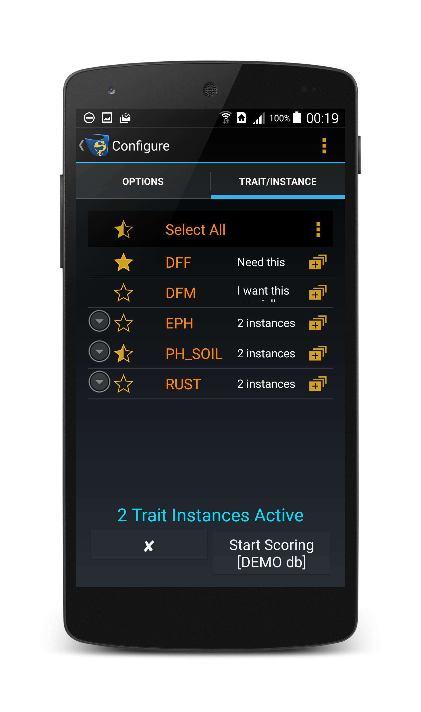

.. include:: imagerefs.txt

.. Following raw and role is required to allow the use of brown text

.. raw:: html

    

.. role:: brown

.. |image4| image:: images/ic_action_visibility_dark_blackback.png
            :scale: 100 %

.. |edit_btn| image:: images/buttons/ic_action_edit.png
            :scale: 50 %

.. |traits| raw:: html

   <a href="http://www.kddart.org/help/kdsmart/html/traits.html" target="_blank">traits</a>

.. |KDSmart| raw:: html

   <a href="http://www.kddart.org/help/kdtutorials/html/KDSTutorial.html" target="_blank">KDSmart</a>

.. |Scoring|  replace:: Scoring page at: http://www.kddart.org/help/kdsmart/html/kdsmarthelp.html

=====================
Preparing for Scoring
=====================

Trials that are scored in KDSmart will require some configuration so that users can score their trials in the way that that is best for their workflow. There are plenty of different configuration options in KDSmart so this section is a guide to preparing for scoring.

Demo vs Production - Where is Your Data Stored?
===============================================

KDSmart contains two separate local databases on the device; the **Production Database** for your real work, and the **Demo Database** for experimenting with KDSmart.

KDSmart helps you identify which database is active in a number of ways:

-  If you see the |image21| **Lockdown Button** at the top of the **Home Screen** then you are using the **Demo Database**.
-  When the **Scoring Configuration Screen** is presented, there is a  *[DEMO db]* label at the bottom.

The |image22| **Lockdown Button** sets KDSmart into **Lockdown Mode**. This mode allows you to control the scoring task without enabling users the ability to change settings or trial attributes.

Use this mode when someone else is to perform the scoring and that is **ALL** they are to do.

To exit **Lockdown Mode**, a four-digit passcode is required. When the **Production Database** is active, **Lockdown Mode** is enabled from the |image23| **Settings Screen**.

.. tabularcolumns:: |\Y{0.12}|\Y{0.88}|

.. list-table:: Demo vs Production Local Database
   :class: longtable
   :widths: 5 70
   :header-rows: 0

   * - **Demo**
     - * Pre-installed demonstration data provided with KDSmart to allow users data to experiment and test KDSmart functionality before working with *real* data.
       * The **Demo Database** can be reset at any time from the **Settings Screen**; use the |image23| **Settings Button** on the **Home Screen** or **Main Menu** to display the **Settings Menu** and choose the **Reset Demo Database Checkbox**.
       * On return from the **Settings Screen**, KDSmart changes to the **Demo Database** and reinitialises the demo data.
   * - **Production**
     - * The local KDSmart database to store your real *production* work.
       * KDSmart installs with an empty **Production Database**.
       * **Lockdown Mode** can be used to prevent data loss - particularly when scoring is not performed by the breeder.

To change the database, select the |image23| **Settings Button** on the **Home Screen** or **Main Menu** to display the **Settings Screen**. Select the *Active Database* option then choose the *Production* or *Demo* radio buttons.

|br|

.. raw:: latex

      \newpage

Trial Details
=============

Trial details are the attributes of each trial such as trial layout, organism type, and traits. The **Trial Details Screen** can be accessed in two ways:

    - Selecting a trial (with a short press) from the **Trials Screen**; and
    - Swiping left/right on the **Home Screen** until the desired trial is found and then Selecting the **Trial Details Button**.

.. tabularcolumns:: |\Y{0.3}|\Y{0.7}|

.. list-table::
   :class: longtable
   :widths: 40 60
   :header-rows: 0

   * - When viewing trial details, those trial attributes that can be edited will have an adjacent |br| |edit_btn| **Edit Button**.
     - .. only:: html

           |center-start|

           .. thumbnail:: images/Preparation/preparation1.png
               :show_caption: true
               :width: 80%
               :align: center
               :title: Trial Details Screen

           |center-end|

       .. only:: latex

           .. figure:: images/Preparation/preparation1.png
              :scale: 17 %
              :alt: Trial Details Screen

              Trial Details Screen

The table below provides information on each trial attribute:
|br|

.. raw:: latex

      \newpage

.. tabularcolumns:: |\Y{0.3}|\Y{0.7}|

.. list-table:: Trial Attributes
   :class: longtable
   :widths: 5 20
   :header-rows: 1

   * - **Trial Attribute**
     - **Description**
   * - **Trial Name**
     - What the trial will be named in KDXplore or KDSmart.
   * - **Abbreviation**
     - An abbreviated trial name for display purposes.
   * - **Planting Date**
     - The date that planting occurred for the trial. Planting date must be set before scoring can commence as the *Elapsed Days* trait data type will not work unless it has been set.
   * - **Plot & X/Y Axis Names**
     - Determines the trial element names that are to appear on scoring screens. |br| These will be names for Plot and X/Y axes, depending upon what was imported.
   * - **Plot Identification**
     - How plots are identified e.g. Block/Block Column/Block Row.
   * - **Trial Layout**
     - At a minimum, there will be an option for choosing the plot origin (starting plot for scoring). Depending on the trial, there may be more options such as block plot origin.
   * - **Organism Type**
     - Provides a choice of the symbol to represent the organism on screen.
   * - **Note**
     - A text note for the trial.
   * - **Traits**
     - Trials may have many traits, however, it is not necessary or desirable for them all to be visible when scoring and traits can be made visible or hidden as required. Select the **Edit Button** to change traits that are used. |br| The blue highlighted panel, near the bottom of the **Scoring Configuration Screen** lists the trait instances available in the trial showing: |br| |important| Traits currently selected for scoring; |br| |not_important| Not selected or hidden; and |br| |half-important| Trait instance(s) selected.
   * - Trial Attributes
     - Non-editable from import
   * - Plot Types
     - Non-editable from import
   * - Plot Attributes
     - Non-editable from import

|br|

.. raw:: latex

      \newpage

Collection Parameters
=====================

Most of the important collection parameters (scoring options) can be found on the **Scoring Configuration Screen**. Swipe left and right between the tabs to view all of the options. The tables below outline the function or options available in each tab and the sections provide more in-depth information.

|br|

Options
--------

.. tabularcolumns:: |\Y{0.5}|\Y{0.5}|

.. list-table:: Options Tab Actions
   :class: longtable
   :header-rows: 1

   * - **Options**
     - **Example Image**
   * - **Collection Order**:

       - Which corner of the field to begin. The four quadrants separated by the grey bars identify the corner of the field where to begin walking.
       - The direction of travel (horizontal or vertical).
       - Whether you will be using a serpentine path or not; e.g. if you are not actually walking but are scoring plants in a tray in a greenhouse.

       **Scoring View**:

       - Scoring views change the way that you score data. There is more information about these modes in the |Scoring|

       - |ssm_btn| - **Sheet Scoring Mode** is a traditional spreadsheet view with added features;
       - |psm_btn| - **Path Scoring Mode** is the best choice for most users and allows for easy navigation between plots; and
       - |fsm_btn| - **Field Scoring Mode** which represents the field from a top-down perspective.

       |ppg_btn| **Plots per Group**:

       - How many plots to score at one time e.g. scoring each plot to your left and right whilst walking along the field would be two plots.

       |lock_btn| **Lock Scored Traits**:

       - Select the **Lock Scored Trait Checkbox** to prevent accidentally overwriting traits that have already been scored. Measurements can still be changed but there will be a warning message.
     -
       |br|

        .. only:: html

            |center-start|

            .. thumbnail:: images/Preparation/preparation2.png
                :show_caption: true
                :width: 100%
                :align: center
                :title: Options Tab

            |center-end|

        .. only:: latex

            .. figure:: images/Preparation/preparation2.png
               :scale: 100 %
               :alt: Options Tab

               Options Tab

        |br|

|br|

.. raw:: latex

      \newpage

Trait/Instance
---------------

.. tabularcolumns:: |\Y{0.5}|\Y{0.5}|

.. list-table:: Trait/Instance Tab Actions
   :class: longtable
   :header-rows: 1

   * - **Options**
     - **Example Image**
   * - **Selecting/Deselecting Traits**:

       **Star Icons** can select or deselect a trait or trait instance for scoring (sets the trait as active or inactive). Setting a trait/instance as inactive does not remove the trait from the trial but removes it from the **Scoring Screen** to prevent unnecessary scrolling.

       - |important| - Selected;
       - |half-important| - Partially selected (at least one but not all trait instances are selected); and
       - |not_important| - Not selected.

       |menu_btn| **Menu Button**:

       The **Menu Button** provides options for adding traits or changing the trait scoring order.

       - |add_btn| - The **Add Traits Button** enables you to select any of your saved traits to add to the trial; and
       - |order_btn| - The **Trait Order Button** option allows you to choose a trait scoring order.
     -
       |br|

        .. only:: html

            |center-start|

            .. thumbnail:: images/Preparation/preparation3.png
                :show_caption: true
                :width: 100%
                :align: center
                :title: Trait/Instance Tab

            |center-end|

        .. only:: latex

            .. figure:: images/Preparation/preparation3.png
               :scale: 100 %
               :alt: Trait/Instance Tab

               Trait/Instance Tab

        |br|
   * - |trait_mng_btn| **Manage Trait Button**:

       Enabled management of traits that are to be scored.

       - |add_btn| - Add a trait to the trial with the **Add Trait Button**;
       - |move_up_btn| - The **Move Up Button** allows you to move the selected trait up in the scoring order;
       - |move_down_btn| - The **Move Down Button** allows you to move the selected trait down in the scoring order;
       - |edit_btn| - Add a trait description with the **Edit Description Button**; and
       - |remove_btn| - Remove a trait from the trial with the **Remove Button**.
     - See above image
   * - |edit_btn| **Edit Trait Instance Button** (the edit icon next to a trait instance):

       Options for editing or removing trait instances.

       - |edit_btn| - Add a trait instance description with the **Edit Description Button**; and
       - |remove_btn| - Remove a trait instance from the trial with the **Remove Button**.
     - See above image

|br|

.. raw:: latex

      \newpage

Choose Tag Bundle
------------------

.. tabularcolumns:: |\Y{0.5}|\Y{0.5}|

.. list-table:: Choosing a Tag Bundle
   :class: longtable
   :header-rows: 1

   * - **Options**
     - **Example Image**
   * - **Choose a Tag Bundle**:

       - Any listed tag bundle can be added with the checkboxes. More tag bundles can be imported or created in the **Tags Screen**.
     -
       |br|

        .. only:: html

            |center-start|

            .. thumbnail:: images/Preparation/preparation4.png
                :show_caption: true
                :width: 100%
                :align: center
                :title: Choose a Tag Bundle

            |center-end|

        .. only:: latex

            .. figure:: images/Preparation/preparation4.png
               :scale: 100 %
               :alt: Choose a Tag Bundle

               Choose a Tag Bundle

        |br|

|br|

.. raw:: latex

      \newpage

Select Blocks
--------------

.. tabularcolumns:: |\Y{0.5}|\Y{0.5}|

.. list-table:: Selecting Blocks
   :class: longtable
   :header-rows: 1

   * - **Options**
     - **Example Image**
   * - **Select Blocks**:

       - Any block trial will have all blocks listed and selectable with the checkboxes. At least one must be chosen. This option will only be available for block trials.
     -
       |br|

        .. only:: html

            |center-start|

            .. thumbnail:: images/Preparation/preparation5.png
                :show_caption: true
                :width: 100%
                :align: center
                :title: Select Blocks

            |center-end|

        .. only:: latex

            .. figure:: images/Preparation/preparation5.png
               :scale: 100 %
               :alt: Select Blocks

               Select Blocks

        |br|

.. raw:: latex

      \newpage

Start Scoring
=============

Scoring can be started in a variety of ways in KDSmart as outlined in the table below:

.. tabularcolumns:: |\Y{0.2}|\Y{0.8}|

.. list-table:: Selecting Blocks
   :class: longtable
   :widths: 20 80
   :header-rows: 1

   * - **Method**
     - **Action**
   * - Quick-start from the **Home Screen**
     - Swipe left and right between the displayed trials until you find the trial that you want to score. Select the |start_btn| **Start Button** to immediately start scoring. If you have scored this trial before then this will resume scoring from where you were before. If this is a new trial you will be taken to the **Scoring Configuration Screen** where you need to confirm collection parameters, then select the |start_btn| **Start Button** to begin.
   * - Trial Details from the **Home Screen**
     - Swipe left and right between the displayed trials until you find the trial that you want to score. Select the **Trial Details Button** and change any of the details if you wish then select the |start_btn| **Start Button**. If you have scored this trial before then this will resume scoring from where you were before. If this is a new trial you will be taken to the **Scoring Configuration Screen** where you need to confirm collection parameters, then select the |start_btn| **Start Button** again to begin.
   * - Quick-start from the **Trials Screen**
     - If there is currently a trial selected, select the |start_btn| **Start Button** to be taken to the **Scoring Configuration Screen** where you can choose collection parameters and then select the **Start Scoring Button** to begin scoring.
   * - Trial Details from the **Trials Screen**
     - Select a trial to immediately display the **Trial Details Screen**. Select the |start_btn| **Start Button** to be taken to the **Scoring Configuration Screen** where you can choose collection parameters and then select the **Start Scoring Button** to begin scoring.

Once all configuration options have been set, scoring can begin. See the |Scoring| for more information.

|br|

.. |find-plots-tag| image:: images/kds-find-plots-tag.png
   :scale: 70 %

.. |not_important| image:: images/ic_action_not_important.png
            :scale: 100 %

.. |image19| image:: images/ic_action_visibility_dark_blackback.png
            :scale: 100 %

.. |image35| image:: images/reverse_black.png
            :scale: 100 %

